# Execution Plan

## Detailed Analysis Summary

### Transformation Scope
- **Transformation Type**: Greenfield single-application build
- **Primary Changes**: Create a new responsive React single-page application with manual gameplay, guided solver support, local persistence, and test coverage
- **Related Components**: UI presentation, puzzle state/rules engine, solver logic, browser persistence, automated tests

### Change Impact Assessment
- **User-facing changes**: Yes - the full deliverable is a new end-user web application
- **Structural changes**: Yes - a new frontend project structure, state model, and test setup must be created
- **Data model changes**: Yes - client-side puzzle state, move history, solver steps, and local persistence payloads need defined types
- **API changes**: No external API or backend contract changes are required in the first release
- **NFR impact**: Yes - responsiveness, usability, maintainability, and local-state reliability all influence the implementation

### Risk Assessment
- **Risk Level**: Medium
- **Rollback Complexity**: Easy, because the work is greenfield and isolated to this new app
- **Testing Complexity**: Moderate, because puzzle rules, failure states, solver logic, and responsive UI behavior all need validation

## Workflow Visualization

```mermaid
flowchart TD
    Start(["User Request"])

    subgraph INCEPTION["INCEPTION PHASE"]
        WD["Workspace Detection<br/><b>COMPLETED</b>"]
        RE["Reverse Engineering<br/><b>SKIP</b>"]
        RA["Requirements Analysis<br/><b>COMPLETED</b>"]
        US["User Stories<br/><b>COMPLETED</b>"]
        WP["Workflow Planning<br/><b>COMPLETED</b>"]
        AD["Application Design<br/><b>EXECUTE</b>"]
        UG["Units Generation<br/><b>EXECUTE</b>"]
    end

    subgraph CONSTRUCTION["CONSTRUCTION PHASE"]
        FD["Functional Design<br/><b>EXECUTE</b>"]
        NFRA["NFR Requirements<br/><b>EXECUTE</b>"]
        NFRD["NFR Design<br/><b>EXECUTE</b>"]
        ID["Infrastructure Design<br/><b>SKIP</b>"]
        CP["Code Planning<br/><b>EXECUTE</b>"]
        CG["Code Generation<br/><b>EXECUTE</b>"]
        BT["Build and Test<br/><b>EXECUTE</b>"]
    end

    subgraph OPERATIONS["OPERATIONS PHASE"]
        OPS["Operations<br/><b>PLACEHOLDER</b>"]
    end

    Start --> WD
    WD --> RE
    RE --> RA
    RA --> US
    US --> WP
    WP --> AD
    AD --> UG
    UG --> FD
    FD --> NFRA
    NFRA --> NFRD
    NFRD --> CP
    CP --> CG
    CG --> BT
    BT --> End(["Complete"])
    BT -.-> OPS

    style WD fill:#4CAF50,stroke:#1B5E20,stroke-width:3px,color:#fff
    style RA fill:#4CAF50,stroke:#1B5E20,stroke-width:3px,color:#fff
    style US fill:#4CAF50,stroke:#1B5E20,stroke-width:3px,color:#fff
    style WP fill:#4CAF50,stroke:#1B5E20,stroke-width:3px,color:#fff
    style CP fill:#4CAF50,stroke:#1B5E20,stroke-width:3px,color:#fff
    style CG fill:#4CAF50,stroke:#1B5E20,stroke-width:3px,color:#fff
    style BT fill:#4CAF50,stroke:#1B5E20,stroke-width:3px,color:#fff
    style AD fill:#FFA726,stroke:#E65100,stroke-width:3px,stroke-dasharray: 5 5,color:#000
    style UG fill:#FFA726,stroke:#E65100,stroke-width:3px,stroke-dasharray: 5 5,color:#000
    style FD fill:#FFA726,stroke:#E65100,stroke-width:3px,stroke-dasharray: 5 5,color:#000
    style NFRA fill:#FFA726,stroke:#E65100,stroke-width:3px,stroke-dasharray: 5 5,color:#000
    style NFRD fill:#FFA726,stroke:#E65100,stroke-width:3px,stroke-dasharray: 5 5,color:#000
    style RE fill:#BDBDBD,stroke:#424242,stroke-width:2px,stroke-dasharray: 5 5,color:#000
    style ID fill:#BDBDBD,stroke:#424242,stroke-width:2px,stroke-dasharray: 5 5,color:#000
    style OPS fill:#BDBDBD,stroke:#424242,stroke-width:2px,stroke-dasharray: 5 5,color:#000
    style Start fill:#CE93D8,stroke:#6A1B9A,stroke-width:3px,color:#000
    style End fill:#CE93D8,stroke:#6A1B9A,stroke-width:3px,color:#000
    style INCEPTION fill:#BBDEFB,stroke:#1565C0,stroke-width:3px,color:#000
    style CONSTRUCTION fill:#C8E6C9,stroke:#2E7D32,stroke-width:3px,color:#000
    style OPERATIONS fill:#FFF59D,stroke:#F57F17,stroke-width:3px,color:#000

    linkStyle default stroke:#333,stroke-width:2px
```

### Text Alternative
- Completed inception stages: Workspace Detection, Requirements Analysis, User Stories, Workflow Planning
- Skipped inception stage: Reverse Engineering because this is a greenfield project
- Planned inception stages: Application Design, then Units Generation
- Planned construction stages: Functional Design, NFR Requirements, NFR Design, Code Planning, Code Generation, Build and Test
- Skipped construction stage: Infrastructure Design because the initial release is a static SPA with no backend infrastructure
- Operations remains a placeholder stage outside the current delivery scope

## Phases to Execute

### 🔵 INCEPTION PHASE
- [x] Workspace Detection (COMPLETED)
- [x] Reverse Engineering (SKIPPED)
  - **Rationale**: No existing application code is present
- [x] Requirements Analysis (COMPLETED)
- [x] User Stories (COMPLETED)
- [x] Workflow Planning (COMPLETED)
- [ ] Application Design - EXECUTE
  - **Rationale**: The app needs clear component boundaries for puzzle state, solver logic, UI composition, and persistence responsibilities
- [ ] Units Generation - EXECUTE
  - **Rationale**: The work benefits from decomposition into implementation units such as puzzle engine, guided solving, UI flow, and persistence/testing

### 🟢 CONSTRUCTION PHASE
- [ ] Functional Design - EXECUTE
  - **Rationale**: Puzzle rules, failure detection, solver sequencing, and state transitions are business logic that need detailed design
- [ ] NFR Requirements - EXECUTE
  - **Rationale**: Responsiveness, usability, client-side performance, and maintainability requirements need to be translated into implementation expectations
- [ ] NFR Design - EXECUTE
  - **Rationale**: The app needs concrete design choices for responsive behavior, modularity, persistence handling, and testability
- [ ] Infrastructure Design - SKIP
  - **Rationale**: The initial release has no backend services, cloud resources, or deployment architecture that needs separate infrastructure mapping
- [ ] Code Planning - EXECUTE
  - **Rationale**: Implementation sequencing and file-level planning are required before generation
- [ ] Code Generation - EXECUTE
  - **Rationale**: Source code, tests, and project scaffolding must be created
- [ ] Build and Test - EXECUTE
  - **Rationale**: The generated application must be validated through build and test workflows

### 🟡 OPERATIONS PHASE
- [ ] Operations - PLACEHOLDER
  - **Rationale**: Deployment and runtime operations are outside the current AI-DLC implementation scope

## Success Criteria
- **Primary Goal**: Deliver a usable river crossing web app with manual play, guided solving, local persistence, and responsive UI
- **Key Deliverables**: Application design artifacts, unit breakdown, implementation plans, production-ready frontend code, automated tests, and build/test instructions
- **Quality Gates**: Puzzle rule correctness, understandable guided solver flow, reliable local storage restoration, responsive layouts, and passing automated verification
